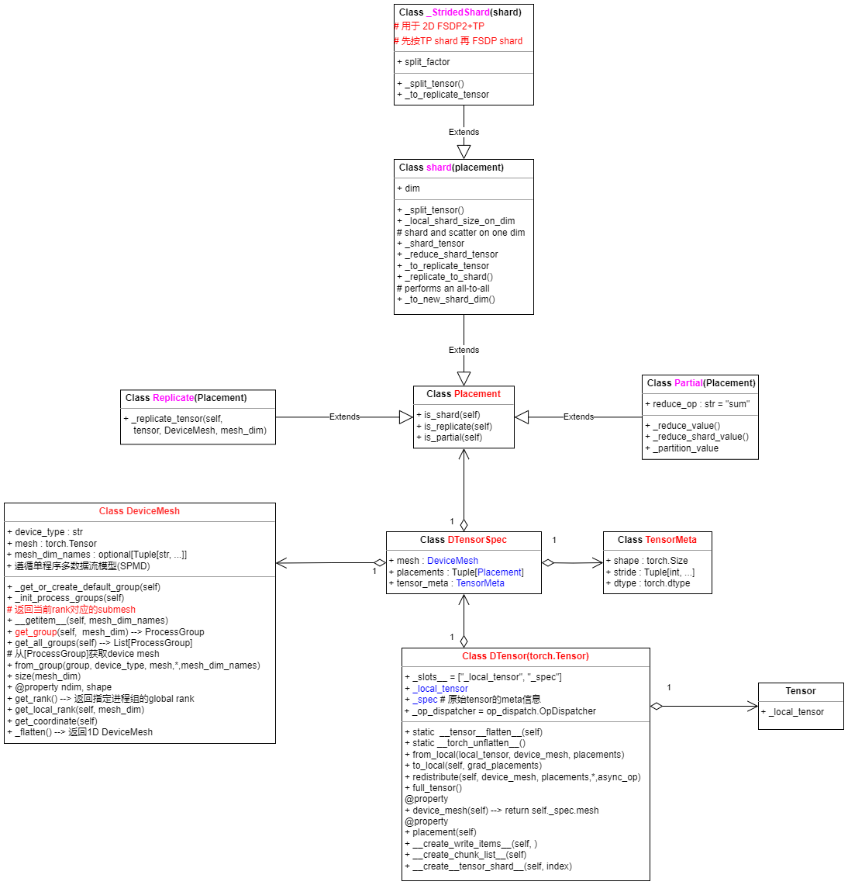
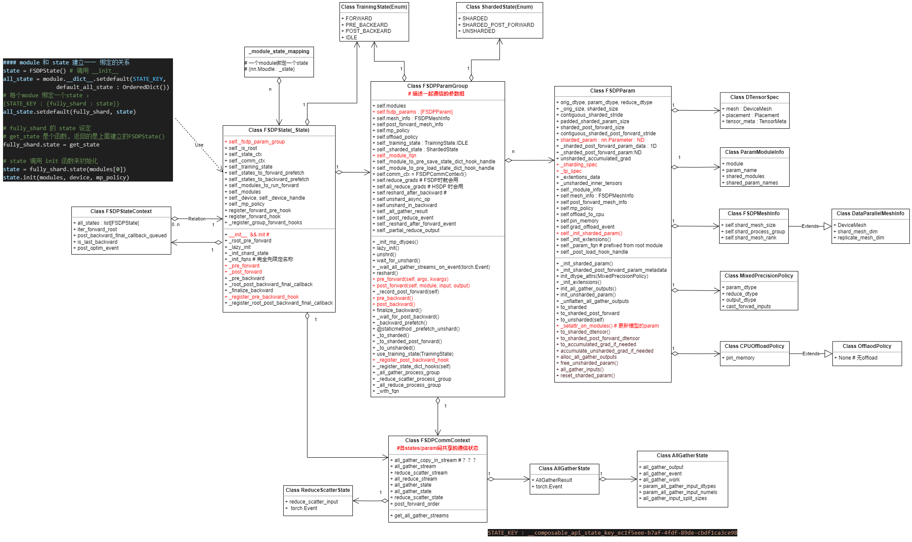
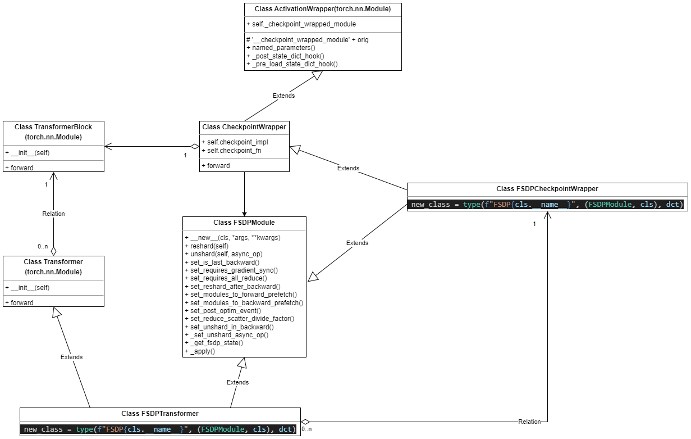
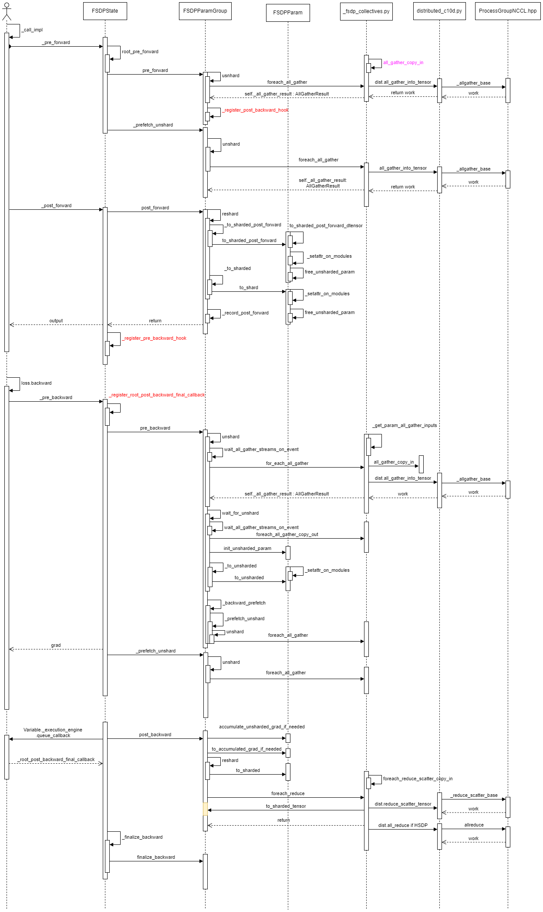

# 1 pytorch fsdp2 新特性
| 名称                              | 描述                                                                                                                                                                                                 |
|-----------------------------------|-----------------------------------------------------------------------------------------------------------------------------------------------------------------------------------------------------|
| Shard Per-Param                   | 对维度0上的每个参数进行分片，来解决`FlatParameter`的局限性。                                                                                                                                         |
| Flexible FP8-Gather               | FP8权重和其他非FP8参数可以在同一个全收集操作中灵活混合。                                                                                                                                             |
| Flexible Frozen Parameters        | 冻结和非冻结参数可以在同一个通信组中灵活混合，而无需使用额外内存。                                                                                                                                   |
| Communication-Free Sharded State Dicts | 使训练和状态字典表示相匹配，从而简化和加速检查点保存。                                                                                                                                               |
| Communication Optimization in the Compiler | 像`torch.compile`这样的partial-graph编译器可以改变`all-gather`/`reduce-scatter`的通信组。                                                                                                           |
| Avoiding RecordStream             | 通过避免使用`recordStream`使得内存释放更加确定，相比于FSDP1，FSDP2的GPU内存平均降低7%。                                                                                                             |
| Efficient Collective Kernels      | 编写了高效的kernels来实现multi-tensor的`allgather`和`reduce scatter`操作，使得通信效率相对于FSDP1没有下降。                                                                                          |

# 2 DeviceMesh and DTensor




# 3 FSDP IMPL relative class



# 4 FSDP + Transformer 双 nn.module



# 5 FSDP Comm




# 6 FSDP2 代码实现

```python
import torch
from torch.distributed._tensor  import DeviceMesh
from torch.distributed.fsdp  import FullyShardedDataParallel as FSDP
from torch.utils.data  import Dataset, DataLoader, DistributedSampler

# 分布式初始化
def setup(rank, world_size):
    torch.distributed.init_process_group(
        backend="nccl",
        init_method="env://",
        rank=rank,
        world_size=world_size
    )
    torch.cuda.set_device(rank)

# 生成随机数据的虚拟数据集
class RandomDataset(Dataset):
    def __init__(self, num_samples=1024):
        self.data  = torch.randn(num_samples,  128)  # 随机特征数据
        self.labels  = torch.randint(0,  10, (num_samples,))  # 随机标签

    def __len__(self):
        return len(self.data)

    def __getitem__(self, idx):
        return self.data[idx],  self.labels[idx]

def main():
    rank = torch.distributed.get_rank()
    world_size = torch.distributed.get_world_size()
    setup(rank, world_size)

    # 创建DeviceMesh
    device_mesh = DeviceMesh(
        "cuda",
        torch.arange(world_size).view(-1)
    )

    # 数据加载（随机数据集）
    dataset = RandomDataset()
    sampler = DistributedSampler(dataset, num_replicas=world_size, rank=rank)
    dataloader = DataLoader(dataset, batch_size=32, sampler=sampler)

    # 模型定义与FSDP包装
    model = torch.nn.Linear(128,  10).cuda()
    fsdp_model = FSDP(
        model,
        device_mesh=device_mesh,
        use_orig_params=True
    )

    # 训练循环
    optimizer = torch.optim.SGD(fsdp_model.parameters(),  lr=0.01)
    for epoch in range(3):
        sampler.set_epoch(epoch)
        for inputs, labels in dataloader:
            inputs, labels = inputs.cuda(),  labels.cuda()
            outputs = fsdp_model(inputs)
            loss = torch.nn.functional.cross_entropy(outputs,  labels)

            optimizer.zero_grad()
            loss.backward()
            optimizer.step()
            if rank == 0:
                print(f"Epoch {epoch} Loss: {loss.item():.4f}")

if __name__ == "__main__":
    main()

```
- 启动指令

```bash
torchrun \
    --nnodes=1 \
    --nproc_per_node=4 \
    --master_addr=localhost \
    --master_port=29500 \
    fsdp_random.py
```

# 参考资料
[why FSDP2](https://github.com/pytorch/torchtitan/blob/main/docs/fsdp.md)
[pytorch DTensor](https://github.com/pytorch/pytorch/blob/main/torch/distributed/tensor/README.md)

