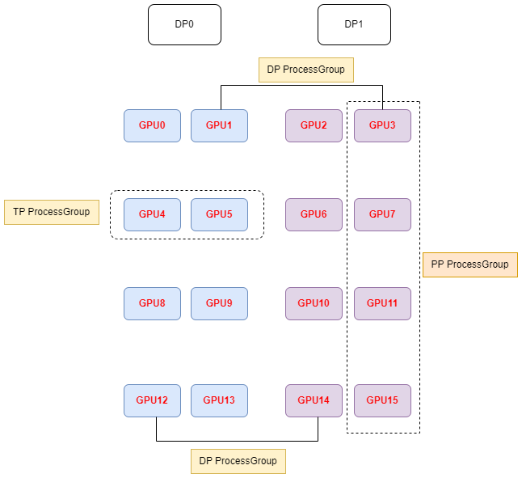
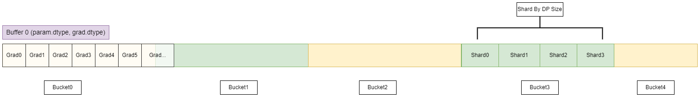
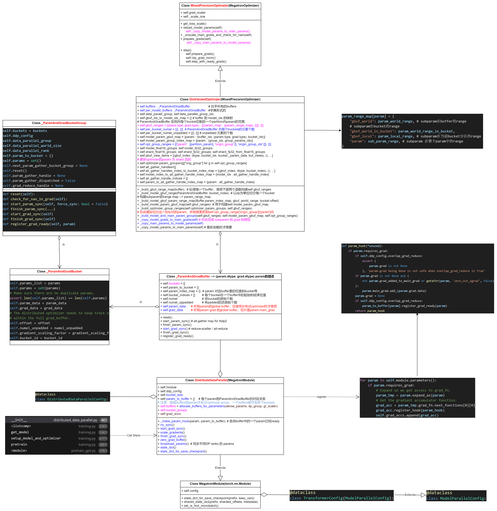

# 0 Megatron-LM ZeRO-1
目前Megatron-LM 里实现的是 ZeRO-1. 结合DistributedDataParallel 实现。

# 1 启动
&nbsp;&nbsp;&nbsp;&nbsp;&nbsp;&nbsp;&nbsp;&nbsp;此处将torchrun 传入的环境变量打包成worker_env 传入启动的进程里。`每个进程根据特定的环境变量来对进程组进行初始化(init_process_group)`。<br>

-[代码链接](https://github.com/pytorch/pytorch/blob/main/torch/distributed/elastic/agent/server/local_elastic_agent.py)

```python
def _start_workers(self, worker_group: WorkerGroup) -> Dict[int, Any]:
    spec = worker_group.spec
    store = worker_group.store
    assert store is not None
    restart_count = spec.max_restarts - self._remaining_restarts

    use_agent_store: bool = spec.rdzv_handler.use_agent_store
    logger.info("use_agent_store: %s", use_agent_store)

    args: Dict[int, Tuple] = {}
    envs: Dict[int, Dict[str, str]] = {}
    log_line_prefixes: Optional[Dict[int, str]] = (
        {} if self._log_line_prefix_template else None
    )
    for worker in worker_group.workers:
        local_rank = worker.local_rank
        worker_env = {
            "LOCAL_RANK": str(local_rank),
            "RANK": str(worker.global_rank),
            "GROUP_RANK": str(worker_group.group_rank),
            "ROLE_RANK": str(worker.role_rank),
            "ROLE_NAME": spec.role,
            "LOCAL_WORLD_SIZE": str(spec.local_world_size),
            "WORLD_SIZE": str(worker.world_size),
            "GROUP_WORLD_SIZE": str(worker_group.group_world_size),
            "ROLE_WORLD_SIZE": str(worker.role_world_size),
            "MASTER_ADDR": worker_group.master_addr,
            "MASTER_PORT": str(worker_group.master_port),
            "TORCHELASTIC_RESTART_COUNT": str(restart_count),
            "TORCHELASTIC_MAX_RESTARTS": str(spec.max_restarts),
            "TORCHELASTIC_RUN_ID": spec.rdzv_handler.get_run_id(),
            "TORCHELASTIC_USE_AGENT_STORE": str(use_agent_store),
            "TORCH_NCCL_ASYNC_ERROR_HANDLING": os.getenv(
                "TORCH_NCCL_ASYNC_ERROR_HANDLING", str(1)
            ),
        }
        if "OMP_NUM_THREADS" in os.environ:
            worker_env["OMP_NUM_THREADS"] = os.environ["OMP_NUM_THREADS"]

        if self._log_line_prefix_template:
            log_line_prefix = Template(
                self._log_line_prefix_template
            ).safe_substitute(
                role_name=spec.role,
                rank=worker.global_rank,
                local_rank=local_rank,
            )
            log_line_prefixes[local_rank] = log_line_prefix

        envs[local_rank] = worker_env
        worker_args = list(spec.args)
        worker_args = macros.substitute(worker_args, str(local_rank))
        args[local_rank] = tuple(worker_args)

    self._setup_local_watchdog(envs=envs)
    self._setup_healthcheck()

    assert spec.entrypoint is not None
    assert self._logs_specs is not None
    self._pcontext = start_processes(
        name=spec.role,
        entrypoint=spec.entrypoint,
        args=args,
        envs=envs,
        logs_specs=self._logs_specs,
        log_line_prefixes=log_line_prefixes,
        start_method=self._start_method,
    )

    return self._pcontext.pids()
```

# 2 megatron-lm 中进程组的初始化

## 2.1 初始化进程组

- [代码链接(training/initialize.py)](https://github.com/NVIDIA/Megatron-LM/blob/main/megatron/training/initialize.py)

```python
def _initialize_distributed(get_embedding_ranks, get_position_embedding_ranks):
    """Initialize torch.distributed and core model parallel."""
    args = get_args()

    device_count = torch.cuda.device_count()
    if torch.distributed.is_initialized():

        if args.rank == 0:
            print(
                "torch distributed is already initialized, "
                "skipping initialization ...",
                flush=True,
            )
        args.rank = torch.distributed.get_rank()
        args.world_size = torch.distributed.get_world_size()

    else:

        if args.rank == 0:
            print("> initializing torch distributed ...", flush=True)
        # Manually set the device ids.
        if device_count > 0:
            torch.cuda.set_device(args.local_rank)
            device_id = torch.device(f'cuda:{args.local_rank}')
        else:
            device_id = None

        # Call the init process
        init_process_group_kwargs = {
            'backend' : args.distributed_backend,
            'world_size': args.world_size,
            'rank': args.rank,
            'timeout': timedelta(minutes=args.distributed_timeout_minutes),
        }

        torch.distributed.init_process_group(**init_process_group_kwargs)

    # Set the tensor model-parallel, pipeline model-parallel, and
    # data-parallel communicators.
    if device_count > 0:
        if mpu.model_parallel_is_initialized():
            print("model parallel is already initialized")
        else:
            mpu.initialize_model_parallel(
                args.tensor_model_parallel_size,
                args.pipeline_model_parallel_size,
                args.virtual_pipeline_model_parallel_size,
                args.pipeline_model_parallel_split_rank,
                context_parallel_size=args.context_parallel_size,
                hierarchical_context_parallel_sizes=args.hierarchical_context_parallel_sizes,
                expert_model_parallel_size=args.expert_model_parallel_size,
                num_distributed_optimizer_instances=args.num_distributed_optimizer_instances,
                expert_tensor_parallel_size=args.expert_tensor_parallel_size,
                distributed_timeout_minutes=args.distributed_timeout_minutes,
                nccl_communicator_config_path=args.nccl_communicator_config_path,
                order='tp-cp-ep-dp-pp' if not args.use_tp_pp_dp_mapping else 'tp-pp-dp',
                encoder_tensor_model_parallel_size=args.encoder_tensor_model_parallel_size,
                encoder_pipeline_model_parallel_size=args.encoder_pipeline_model_parallel_size,
                get_embedding_ranks=get_embedding_ranks,
                get_position_embedding_ranks=get_position_embedding_ranks,
            )
            if args.rank == 0:
                print(
                    f"> initialized tensor model parallel with size "
                    f"{mpu.get_tensor_model_parallel_world_size()}"
                )
                print(
                    f"> initialized pipeline model parallel with size "
                    f"{mpu.get_pipeline_model_parallel_world_size()}"
                )
```

## 2.2 划分进程组

在 mpu.initialize_model_parallel 里进行真正的各不同ProcessGroup里进程组的初始化。每个进程可能会创建多个进程组。

```python
new_group

    Let's say we have a total of 16 GPUs denoted by g0 ... g15 and we  use 2 GPUs to parallelize the model tensor, and 4 GPUs to parallelize  the model pipeline.

   The present function will create 8 tensor model-parallel groups, 4 pipeline model-parallel groups  and 8 data-parallel groups as:


        8 data_parallel groups:
            [g0, g2], [g1, g3], [g4, g6], [g5, g7], [g8, g10], [g9, g11], [g12, g14], [g13, g15]
        8 tensor model-parallel groups:
            [g0, g1], [g2, g3], [g4, g5], [g6, g7], [g8, g9], [g10, g11], [g12, g13], [g14, g15]
        4 pipeline model-parallel groups:
            [g0, g4, g8, g12], [g1, g5, g9, g13], [g2, g6, g10, g14], [g3, g7, g11, g15]


    Note that for efficiency, the caller should make sure adjacent ranks  are on the same DGX box（机箱）. For example if we are using 2 DGX-1 boxes
    with a total of 16 GPUs, rank 0 to 7 belong to the first box and  ranks 8 to 15 belong to the second box.
```
**进程组与GPU对应关系** <br>




## 2.3 进程组并行状态管理

- [parallel_state.py](https://github.com/NVIDIA/Megatron-LM/blob/main/megatron/training/initialize.py)

每个进程中会拥有多个进程组，分别来控制当前进程的DP、TP、PP等通信任务。当前进程的所有进程组作为全局变量存储在parallel_state.py中。<br>

```python
# Intra-layer model parallel group that the current rank belongs to.
_TENSOR_MODEL_PARALLEL_GROUP = None
# Inter-layer model parallel group that the current rank belongs to.
_PIPELINE_MODEL_PARALLEL_GROUP = None
# Model parallel group (both intra- and pipeline) that the current rank belongs to.
_MODEL_PARALLEL_GROUP = None
# Model parallel group (both intra-, pipeline, and expert) that the current rank belongs to.
_MODEL_AND_EXPERT_PARALLEL_GROUP = None
# Embedding group.
_EMBEDDING_GROUP = None
# Position embedding group.
_POSITION_EMBEDDING_GROUP = None
# Data parallel group that the current rank belongs to.
_DATA_PARALLEL_GROUP = None
_DATA_PARALLEL_GROUP_GLOO = None
# tensor model parallel group and data parallel group combined
# used for fp8 and moe training
_TENSOR_AND_DATA_PARALLEL_GROUP = None
# Expert parallel group that the current rank belongs to.
_EXPERT_MODEL_PARALLEL_GROUP = None
_TENSOR_AND_EXPERT_PARALLEL_GROUP = None
_DATA_MODULO_EXPERT_PARALLEL_GROUP = None
_DATA_MODULO_EXPERT_PARALLEL_GROUP_GLOO = None
_DATA_MODULO_EXPERT_PARALLEL_GROUP_WITH_CP = None
_DATA_MODULO_EXPERT_PARALLEL_GROUP_WITH_CP_GLOO = None


_VIRTUAL_PIPELINE_MODEL_PARALLEL_RANK = None
_VIRTUAL_PIPELINE_MODEL_PARALLEL_WORLD_SIZE = None
_PIPELINE_MODEL_PARALLEL_SPLIT_RANK = None

_PIPELINE_MODEL_PARALLEL_DECODER_START = None

# These values enable us to change the mpu sizes on the fly.
_MPU_TENSOR_MODEL_PARALLEL_WORLD_SIZE = None
_MPU_PIPELINE_MODEL_PARALLEL_WORLD_SIZE = None
_MPU_EXPERT_MODEL_PARALLEL_WORLD_SIZE = None
_MPU_DATA_PARALLEL_WORLD_SIZE = None
_MPU_DATA_PARALLEL_RANK = None
_MPU_TENSOR_MODEL_PARALLEL_RANK = None
_MPU_PIPELINE_MODEL_PARALLEL_RANK = None
_MPU_EXPERT_MODEL_PARALLEL_RANK = None

# A list of ranks that have a copy of the embedding.
_EMBEDDING_GLOBAL_RANKS = None

# A list of ranks that have a copy of the position embedding.
_POSITION_EMBEDDING_GLOBAL_RANKS = None

# A list of global ranks for each pipeline group to ease calculation of the source
# rank when broadcasting from the first or last pipeline stage.
_PIPELINE_GLOBAL_RANKS = None

# A list of global ranks for each data parallel group to ease calculation of the source
# rank when broadcasting weights from src to all other data parallel ranks
_DATA_PARALLEL_GLOBAL_RANKS = None

# A list of global ranks for each tensor model parallel group to ease calculation of
# the first local rank in the tensor model parallel group
_TENSOR_MODEL_PARALLEL_GLOBAL_RANKS = None

# Context parallel group that the current rank belongs to
_CONTEXT_PARALLEL_GROUP = None
# A list of global ranks for each context parallel group to ease calculation of the
# destination rank when exchanging KV/dKV between context parallel_ranks
_CONTEXT_PARALLEL_GLOBAL_RANKS = None

# Data parallel group information with context parallel combined.
_DATA_PARALLEL_GROUP_WITH_CP = None
_DATA_PARALLEL_GROUP_WITH_CP_GLOO = None
_DATA_PARALLEL_GLOBAL_RANKS_WITH_CP = None

# combined parallel group of TP and CP
_TENSOR_AND_CONTEXT_PARALLEL_GROUP = None

# combined parallel group of TP, DP, and CP used for fp8
_TENSOR_AND_DATA_PARALLEL_GROUP_WITH_CP = None

# Memory buffers to avoid dynamic memory allocation
_GLOBAL_MEMORY_BUFFER = None

# MOE logging
_MOE_LAYER_WISE_LOGGING_TRACKER = {}
```

# 3 Megatron-lm 中的数据并行

## 3.1 数据并行调用栈 <br>

```python
__init__                      distributed_data_parallel.py:44
<listcomp>                    training.py:534
get_model                     training.py:534
setup_model_and_optimizer     training.py:617
pretrain                      training.py:289
<module>                      pretrain_gpt.py:278
```

## 3.2 Zero-1 数据组织




# 4 DistributedOptimizer

一个buffer会却分成多个bucket, Zero 是在Bucket上进行切分的。`buffer里的每个bucket都要切成data_parallel_world_size份。` <br>

几个关键函数：<br>

## 4.1 _build_gbuf_range_map

- 代码将遍历梯度缓冲区（grad buffer）的所有桶（buckets），以构建当前进程“拥有”的参数范围(注意是当前进程在buffer里的参数范围)。

- 这里的“拥有”是指每个进程负责梯度缓冲区中每个桶的特定分片（shard），其中每个分片的大小是桶大小的1/dp_world_size，dp_world_size是数据并行组中的进程数量。

## 4.2 __build_model_gbuf__param_range_map

- 由于梯度缓冲区的分区方式不考虑参数边界，因此每个数据并行进程实际上是在对梯度缓冲区的视图（views）进行操作，而不是直接对完整的参数进行操作。

- 这些操作包括梯度的规约（reduce）和参数的更新（gather）。

## 4.3 optimizer state

- 鉴于之前方法中创建的概念性梯度缓冲区划分并不遵循参数的边界，**优化器操作的是模型参数的分片**，而非完整参数。


# 5 代码结构



# 6 实现细节
## 6.1 区分dense_param 和 expert_parallel_params

- [distributed_data_parallel](https://github1s.com/NVIDIA/Megatron-LM/blob/main/megatron/core/distributed/distributed_data_parallel.py#L99-L102)
```python
    if getattr(param, 'allreduce', True):
        dense_params.append(param)
    else:
        expert_parallel_params.append(param)
```

## 6.2 按照param_dtype 和 grad_dtype 分组
- [distributed_data_parallel](https://github1s.com/NVIDIA/Megatron-LM/blob/main/megatron/core/distributed/distributed_data_parallel.py#L130-L144)

```python
    # Get the index of each param among the params with same dtype, if a param is fp8,
    # use its "fake" high precision dtype to find which params have same dtype with it.
    # For example:
    #     Case 1:
    #         params = [p1(bf16), p2(bf16), p3(bf16), p4(bf16)]
    #         param_and_grad_dtype_to_indices = {
    #             (torch.bfloat16, torch.float32): [0, 1, 2, 3],
    #         }
    #     Case 2:
    #         params = [p1(bf16), p2(fp8), p3(fp8), p4(bf16)]
    #         param_and_grad_dtype_to_indices = {
    #             (torch.bfloat16, torch.float32): [0, 3],
    #             (torch.uint8, torch.float32): [1, 2],
    #         }
    # We need these indices to load a non-native-fp8 checkpoint in native-fp8 mode.
```

## 6.3 将分组的Params用_ParamAndGradBuffer 封装

- [distributed_data_parallel](https://github1s.com/NVIDIA/Megatron-LM/blob/main/megatron/core/distributed/distributed_data_parallel.py#L178-L193)

```python
# Allocate the grad buffers and map the grads.
buffers = []
for (param_dtype, grad_dtype), params in param_and_grad_dtype_to_params.items():
    buffers.append(
        _ParamAndGradBuffer(
            self.ddp_config,
            param_dtype,
            grad_dtype,
            params,
            data_parallel_group,
            self.bucket_size,
            param_to_name,
            gradient_scaling_factor,
            param_and_grad_dtype_to_indices[(param_dtype, grad_dtype)],
        )
    )
```

## 6.4 遍历Parameters 得到每self.bucket_indices self.numel 等参数

- [distributed_data_parallel](https://github1s.com/NVIDIA/Megatron-LM/blob/main/megatron/core/distributed/param_and_grad_buffer.py#L541-L559)

## 6.5 总buffer的初始化 : self.param_data and self.grad_data
- [distributed_data_parallel](https://github1s.com/NVIDIA/Megatron-LM/blob/main/megatron/core/distributed/param_and_grad_buffer.py#L620-L633)

```python
    # Only re-map param tensors if using distributed optimizer.
    if self.ddp_config.use_distributed_optimizer:
        self.param_data = torch.zeros(
            self.numel,
            dtype=self.param_dtype,
            device=torch.cuda.current_device(),
            requires_grad=False,
        )
    self.grad_data = torch.zeros(
        self.numel,
        dtype=self.grad_dtype,
        device=torch.cuda.current_device(),
        requires_grad=False,
    )
```

## 6.6 显存copy，并构造bucket

- [distributed_data_parallel](https://github1s.com/NVIDIA/Megatron-LM/blob/main/megatron/core/distributed/param_and_grad_buffer.py#L636-L676)

```python
    def _get(self, shape: torch.Size, start_index: int, buffer_type: BufferType) -> torch.Tensor:
        """
        Return a tensor with the input `shape` as a view into the 1-D data starting at
        `start_index`.
        """
        end_index = start_index + shape.numel()
        assert end_index <= self.numel, 'Requested tensor is out of buffer range'
        if buffer_type == BufferType.PARAM:
            assert self.param_data is not None
            buffer_tensor = self.param_data[start_index:end_index]
        elif buffer_type == BufferType.GRAD:
            buffer_tensor = self.grad_data[start_index:end_index]
        else:
            raise Exception("Illegal buffer type provided to GradBuffer._get() function")
        buffer_tensor = buffer_tensor.view(shape)
        return buffer_tensor

    for param in params[::-1]:
        param_start_index, param_end_index, bucket_id = self.param_index_map[param]

        # Assign param.data to appropriate segment of self.param_data.
        if self.param_data is not None:
            old_param_data = param.data
            new_param_data = self._get(
                param.data.shape, param_start_index, buffer_type=BufferType.PARAM
            )
            if is_float8tensor(param):
                param._data = new_param_data
            else:
                param.data = new_param_data
            assert old_param_data._base is None
            # Copy tensor values (from initialization or checkpoint).
            param.data.detach().copy_(old_param_data)
            del old_param_data # Free origin memory.

        param.main_grad = self._get( # Gradient buffer.
            param.data.shape, param_start_index, buffer_type=BufferType.GRAD
        )
```

## 6.6 每个param都事先准备一个main_grad

- [distributed_data_parallel](https://github1s.com/NVIDIA/Megatron-LM/blob/main/megatron/core/distributed/param_and_grad_buffer.py#L657-L659)

```
param.main_grad = self._get( # Gradient buffer.
    param.data.shape, param_start_index, buffer_type=BufferType.GRAD
)
```

## 6.7 _ParamAndGradBucket 里初始化
- 零散的params
- 合并的param_data
- 合并的grad_data

- [distributed_data_parallel](https://github1s.com/NVIDIA/Megatron-LM/blob/main/megatron/core/distributed/param_and_grad_buffer.py#L749-L770)

```python
    bucketed_param_data = None
    if self.param_data is not None:
        bucketed_param_data = self._get(
            torch.Size([end_index - start_index]), start_index, buffer_type=BufferType.PARAM
        )
    bucketed_grad_data = self._get(
        torch.Size([end_index - start_index]), start_index, buffer_type=BufferType.GRAD
    )
    bucket = _ParamAndGradBucket(
        params=bucket_params,
        param_data=bucketed_param_data,
        grad_data=bucketed_grad_data,
        offset=start_index,
        numel_unpadded=numel_unpadded,
        gradient_scaling_factor=self.gradient_scaling_factor,
        bucket_id=bucket_id,
    )
    for bucket_param in bucket_params:
        assert bucket_param not in self.param_to_bucket
        self.param_to_bucket[bucket_param] = bucket

    return bucket
```

## 6.8 注意：DP 组 和 Context 组 可能会耦合

```python
# Allocate the param+grad buffers for dense params' grads.
self.buffers, self.bucket_groups = _allocate_buffers_for_parameters(
    dense_params,
    parallel_state.get_data_parallel_group(with_context_parallel=True),
    gradient_scaling_factor=gradient_scaling_factor,
)

def get_data_parallel_group(with_context_parallel=False):
    """Get the data-parallel group the caller rank belongs to."""
    if with_context_parallel:
        assert (
            _DATA_PARALLEL_GROUP_WITH_CP is not None
        ), 'data parallel group with context parallel combined is not initialized'
        return _DATA_PARALLEL_GROUP_WITH_CP
    else:
        assert _DATA_PARALLEL_GROUP is not None, 'data parallel group is not initialized'
        return _DATA_PARALLEL_GROUP
```

# 6.8 partition_buckets 将 每个buffer里的bucket打包成总的bucket group

- [distributed_data_parallel](https://github1s.com/NVIDIA/Megatron-LM/blob/main/megatron/core/distributed/distributed_data_parallel.py#L204)

```pythn
bucket_groups = partition_buckets(buffers, force_single_bucket_group=disable_bucketing)

def partition_buckets(
    buffers: List[_ParamAndGradBuffer], force_single_bucket_group: bool = False
) -> List[_ParamAndGradBucketGroup]:
```

## 6.9 首尾连接 各bucket

- 因为分布式优化器逆向做all-gather in reverse order of bucket

- [distributed_data_parallel](https://github1s.com/NVIDIA/Megatron-LM/blob/main/megatron/core/distributed/distributed_data_parallel.py#L222-L227)

```python
    # Set `next_param_gather_bucket_group` for different bucket groups by iterating through
    # buckets in reverse order (since all-gathers happen in reverse order of buckets).
    if self.ddp_config.use_distributed_optimizer and self.ddp_config.overlap_param_gather:
        num_bucket_groups = len(bucket_groups)
        for i in range(1, num_bucket_groups):
            bucket_groups[num_bucket_groups - i].next_param_gather_bucket_group = (
                bucket_groups[num_bucket_groups - i - 1]
            )
```

## 6.10 建立param 到 每个bucket的映射关系
- [distributed_data_parallel](https://github1s.com/NVIDIA/Megatron-LM/blob/main/megatron/core/distributed/distributed_data_parallel.py#L229-L233)

```python
    # Create map from param to bucket group, used in pre_hook.
    for bucket_group in bucket_groups:
        for bucket in bucket_group.buckets:
            for param in bucket.params_list:
                self.param_to_bucket_group[param] = bucket_group

```

## 6.11 上述流程最终返回 self.buffers, self.bucket_groups

```python
    # Allocate the param+grad buffers for dense params' grads.
    self.buffers, self.bucket_groups = _allocate_buffers_for_parameters(
        dense_params,
        parallel_state.get_data_parallel_group(with_context_parallel=True),
        gradient_scaling_factor=gradient_scaling_factor,
    )
```

## 6.12 单独创建专家的 buffer 和 bucket_groups

- [distributed_data_parallel](https://github1s.com/NVIDIA/Megatron-LM/blob/main/megatron/core/distributed/distributed_data_parallel.py#L284-L291)

```python
    # Allocate separate param+grad buffers for expert parallel params' grads.
    self.expert_parallel_buffers, self.expert_parallel_bucket_groups = (
        _allocate_buffers_for_parameters(
            expert_parallel_params,
            parallel_state.get_data_modulo_expert_parallel_group(with_context_parallel=True),
            gradient_scaling_factor=expert_gradient_scaling_factor,
        )
    )
```

## 6.13 为每个参数注册反向钩子函数

- [distributed_data_parallel](https://github1s.com/NVIDIA/Megatron-LM/blob/main/megatron/core/distributed/distributed_data_parallel.py#L309-L317)

```python
    # Register backward hook.
    # Accumulation function for the gradients need to be stored so they
    # don't go out of scope.
    self.grad_accs = []
    for param in self.module.parameters():
        if param.requires_grad:
            # Expand so we get access to grad_fn.
            param_tmp = param.expand_as(param)
            # Get the gradient accumulator function.
            grad_acc = param_tmp.grad_fn.next_functions[0][0]
            grad_acc.register_hook(self._make_backward_post_hook(param))
            self.grad_accs.append(grad_acc)
```

## 6.14 具体的反向钩子函数

- [distributed_data_parallel](https://github1s.com/NVIDIA/Megatron-LM/blob/main/megatron/core/distributed/distributed_data_parallel.py##L392-L418)

- **param的梯度copy到 main_grad, 同时将param里的自带grad 清空 : param.grad = None**
- **该bucket里param均计算完事后，register_grad_ready, 并开始ReduceScatter**

```python
    def _make_backward_post_hook(self, param: torch.nn.Parameter):
        """
        Creates a backward post-hook to dispatch an all-reduce / reduce-scatter when
        ready (i.e., when all grads in a bucket have been computed in all microbatches
        in a batch).
        """

        def hook(*unused):
            if param in self.param_to_bucket_group:
                assert param.requires_grad
                if self.ddp_config.overlap_grad_reduce:
                    assert (
                        param.grad is not None
                    ), 'param.grad being None is not safe when overlap_grad_reduce is True'
                if param.grad is not None and (
                    not param.grad_added_to_main_grad or getattr(param, 'zero_out_wgrad', False)
                ):
                    param.main_grad.add_(param.grad.data)
                param.grad = None

                if self.ddp_config.overlap_grad_reduce:
                    self.param_to_bucket_group[param].register_grad_ready(param)

        return hook
```

## 6.15 在 register_grad_ready 里进行 start_grad_sync

- **注意: DistributedOptimizer 对应这里的 reduce_scatter, 其实是`Zero1`, 只是更新了一个bucket里自己对应的那部分的grad, 但总的 grad 还是那么大。** <br>

- [distributed_data_parallel](https://github1s.com/NVIDIA/Megatron-LM/blob/main/megatron/core/distributed/param_and_grad_buffer.py#L342-L358)

```python
    # Coalesce communication kernels across buckets in the bucket group.
    with stream_context, _coalescing_manager(communication_group, async_ops=async_op) as cm:
        for bucket in self.buckets:
            if self.ddp_config.use_distributed_optimizer:
                local_data_view = shard_buffer(
                    bucket.grad_data, self.intra_distributed_optimizer_instance_size
                )[self.intra_distributed_optimizer_instance_rank]
                dist_reduce_scatter_func(
                    local_data_view,
                    bucket.grad_data,
                    op=reduce_op,
                    group=communication_group,
                    async_op=async_op,
                )
            else:
                torch.distributed.all_reduce(
                    bucket.grad_data, op=reduce_op, group=communication_group, async_op=async_op
                )
```

## 6.16 forward 时必须等带 weight的all_gather 结束

```python
    def _make_forward_pre_hook(self):
        """
        Create a forward pre-hook to wait on all-gather handles when necessary (i.e.,
        when a module uses a parameter in a bucket with a still incomplete all-gather).
        """

        def hook(module, *unused):
            assert (
                self.use_forward_hook
            ), "Should use pre-hook only when overlap_param_gather is True"

            # Make sure all parameters in this module have been all-gathered as necessary.
            for param in module.parameters(recurse=False):
                # Skip parameters without an associated buffer (such parameters have a
                # .requires_grad field equal to False).
                if param not in self.param_to_bucket_group:
                    continue
                assert param.requires_grad

                # If aligning param all-gather across pipeline stages, all-gather is dispatched
                # by start_param_sync calls in core/pipeline_parallelism/schedules.py.
                # If overlapping param all-gather with optimizer step, then all-gather has
                # already been dispatched in optimizer step.
                skip_next_bucket_dispatch = (
                    self.ddp_config.align_param_gather
                    or self.overlap_param_gather_with_optimizer_step
                )
                self.param_to_bucket_group[param].finish_param_sync(
                    skip_next_bucket_dispatch=skip_next_bucket_dispatch
                )

        return hook
```

## 6.17 具体进行 all_gather 之处

- 通过DDP的前向钩子进行的，确定的，不是在DistributedOptimzier 里进行的。


- [distributed_data_parallel](https://github1s.com/NVIDIA/Megatron-LM/blob/main/megatron/core/distributed/param_and_grad_buffer.py#L193-L239)

```python
def start_param_sync(self, force_sync: bool = False):
        """
        Initiates all necessary param all-gathers for this bucket.

        When ddp_config.overlap_param_gather is set to True, dispatches an asynchronous
        communication call (unless force_sync is True). When ddp_config.overlap_param_gather
        is set to False, makes synchronous call.

        Args:
            force_sync (bool, optional): force synchronous collective regardless of
                other settings if true.
        """
        assert self.ddp_config.use_distributed_optimizer

        if force_sync:
            if self.param_gather_handle is not None:
                self.param_gather_handle.wait()
                self.param_gather_handle = None
                return
        else:
            assert self.param_gather_handle is None

        async_op = self.ddp_config.overlap_param_gather and not force_sync
        # Coalesce communication kernels across buckets in the bucket group.
        with _coalescing_manager(
            self.intra_distributed_optimizer_instance_group, async_ops=async_op
        ) as cm:
            for bucket in self.buckets:
                local_data_view = shard_buffer(
                    bucket.param_data, self.intra_distributed_optimizer_instance_size
                )[self.intra_distributed_optimizer_instance_rank]
                dist_all_gather_func(
                    bucket.param_data,
                    local_data_view,
                    group=self.intra_distributed_optimizer_instance_group,
                    async_op=async_op,
                )
        if async_op:
            self.param_gather_handle = cm
        else:
            # When using `_coalescing_manager`, even if a synchronous op (async_op=False) is used,
            # `cm` is not None, which is different from when `_coalescing_manager` is not used in
            # which case the torch.distributed._all_gather_base() will return None. In order to
            # maintain consistency with prior code, we need to manually set communication handle to
            # None.
            self.param_gather_handle = None
        self.param_gather_dispatched = True
```


# 7 DistributedOptimizer

## 7.1 DistributedOptimizer 的初始化
- 用每个model的buffers来初始化DistributedOptimizer;

```python
    optimizer = DistributedOptimizer(
        *optimizer_args,
        model_chunks=model_chunks,
        per_model_buffers=per_model_buffers,
        data_parallel_group=data_parallel_group,
        data_parallel_group_gloo=data_parallel_group_gloo,
        data_parallel_group_idx=data_parallel_group_idx,
)
```

## 7.2 DistributedOptimzier 中额外clone 出 fp32 的 param

- [shard_main_param](https://github1s.com/NVIDIA/Megatron-LM/blob/main/megatron/core/optimizer/distrib_optimizer.py#L379-L380)

```python
  shard_main_param = shard_model_param.clone().float() # fp32的副本
```

## 7.3 DistributedOptimzier 中 params 的更新

- [_build_model_and_main_param_groups](https://github1s.com/NVIDIA/Megatron-LM/blob/main/megatron/core/optimizer/distrib_optimizer.py#L419-L430)

```python
    # Update optimizer's params.
    if not config.use_precision_aware_optimizer:
        group_range["orig_group"]["params"] = [
            *shard_fp32_params_this_group,
            *shard_fp32_from_float16_params_this_group,
        ]
    else:
        group_range["orig_group"]["params"] = [
            *shard_fp32_params_this_group,
            *shard_float16_params_this_group,
        ]
```

## 7.4 MixedPrecisionOptimizer step 中完成参数转化和更新

- [DistributedOptimizer](https://github1s.com/NVIDIA/Megatron-LM/blob/main/megatron/core/optimizer/optimizer.py#L469-L500)

1. step1: self.prepare_grads() : 将 param.main_grad 切片到 shard_main_param.grad
2. step2: 完成参数更新
3. step3: 将shard_main_param 再copy 回 shard_model_param

```python
@torch.no_grad()
    def step(self):
        timers = self.config.timers

        found_inf_flag = self.prepare_grads()
        if found_inf_flag:
            return False, None, None

        # Clip the main gradients.
        if timers is not None:
            timers('optimizer-clip-main-grad', log_level=1).start(
                barrier=self.config.barrier_with_L1_time
            )
        grad_norm = 0.0
        if self.config.clip_grad > 0.0:
            grad_norm = self.clip_grad_norm(self.config.clip_grad)
        if timers is not None:
            timers('optimizer-clip-main-grad').stop()

        # Count the zeros in the grads.
        if timers is not None:
            timers('optimizer-count-zeros', log_level=1).start(
                barrier=self.config.barrier_with_L1_time
            )
        num_zeros_in_grad = self.count_zeros() if self.config.log_num_zeros_in_grad else 0
        if timers is not None:
            timers('optimizer-count-zeros').stop()

        success = self.step_with_ready_grads()

        # Successful update.
        return success, grad_norm, num_zeros_in_grad
```

# 7.5 梯度抽取到切片:

- [copy_group_grads](https://github1s.com/NVIDIA/Megatron-LM/blob/main/megatron/core/optimizer/distrib_optimizer.py#L1931-L1950)

- 对model的属于当前进程的param的grad : model_param.main_grad 进行切片;
- 将切片后的grad进行copy到shard_main_groups中;
- copy_group_grads 函数定义在_copy_model_grads_to_main_grads 函数内;

```python
    # Utility method for copying group grads.
    def copy_group_grads(model_groups, shard_main_groups):
        for model_group, shard_main_group in zip(model_groups, shard_main_groups):
            for model_param, shard_main_param in zip(model_group, shard_main_group):

                param_range_map = self._get_model_param_range_map(model_param)
                param_range = param_range_map["param"]
                assert param_range.size == shard_main_param.nelement()

                model_grad = model_param.main_grad
                shard_model_grad = model_grad.view(-1)[param_range.start : param_range.end]
                if self.config.use_precision_aware_optimizer:
                    # Pytorch requires a param and its' grad to be the same dtype, but we want
                    # their types to be different in precision-aware optimizer. So we use
                    # ".decoupled_grad" to replace ".grad".
                    # Note that this requires corresponding modifications in the optimizer (Let
                    # the optimizer read gradients from ".decoupled_grad" instead of ".grad").
                    shard_main_param.decoupled_grad = shard_model_grad
                else:
                    shard_main_param.grad = shard_model_grad.float()
```

## 7.6 更新后的 param 再 copy 到 weight

- [DistributedOptimizer](https://github1s.com/NVIDIA/Megatron-LM/blob/main/megatron/core/optimizer/optimizer.py#L443-L467)

```python
    @torch.no_grad()
    def step_with_ready_grads(self) -> bool:
        """Step the optimizer with ready gradients, return successful."""
        timers = self.config.timers
        # Step the optimizer.
        if timers is not None:
            timers('optimizer-inner-step', log_level=1).start(
                barrier=self.config.barrier_with_L1_time
            )
        if not self.is_stub_optimizer:
            self.optimizer.step()
        if timers is not None:
            timers('optimizer-inner-step').stop()

        # Update params from main params.
        if timers is not None:
            timers('optimizer-copy-main-to-model-params', log_level=1).start(
                barrier=self.config.barrier_with_L1_time
            )
        if not self.is_stub_optimizer:
            self._copy_main_params_to_model_params()
        if timers is not None:
            timers('optimizer-copy-main-to-model-params').stop()

        return True
```

- [_copy_main_params_to_model_params](https://github1s.com/NVIDIA/Megatron-LM/blob/main/megatron/core/optimizer/distrib_optimizer.py#L1976-L2013)

```python
# Utility method for copying group params.
    def copy_group_params(shard_main_groups, model_groups):
        for shard_main_group, model_group in zip(shard_main_groups, model_groups):
            for shard_main_param, model_param in zip(shard_main_group, model_group):

                param_range_map = self._get_model_param_range_map(model_param)
                world_range = param_range_map["gbuf_world_in_bucket"]

                assert world_range.size == shard_main_param.nelement()

                gbuf_index, _, bucket_id = self.model_param_gbuf_map[model_param]
                model_param_buffer = self.buffers[gbuf_index].buckets[bucket_id].param_data

                shard_model_param = model_param_buffer.view(-1)[
                    world_range.start : world_range.end
                ]

                if is_float8tensor(model_param):
                    # 1. When "--fp8-param-gather" is disabled, the main param is first cast to
                    #    BF16/FP16, and then cast to FP8, so the amax_history is calculated
                    #    using BF16/FP16 param.
                    # 2. When "--fp8-param-gather" is enabled, we can cast the FP32 main param
                    #    to FP8 directly, which results in slightly different results with
                    #    higher speed. In theory, this does not affect convergence.
                    # TODO: The following code maintains the logic of the point-1 above. It can
                    # be deleted if it is not necessary.
                    shard_main_param = shard_main_param.to(model_param.dtype)

                    quantize_param_fragment(
                        shard_main_param, out=shard_model_param, param=model_param
                    )
                else:
                    shard_model_param.data.copy_(shard_main_param)

    # When using precision-aware optimizer, main params are held by self.optimizer. It will also
    # do the work of copying data from main params to model params.
    if self.config.use_precision_aware_optimizer:
        return
```


