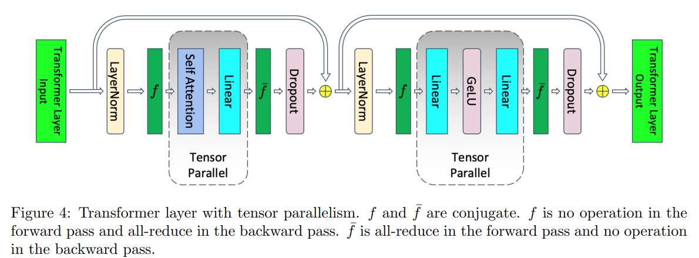
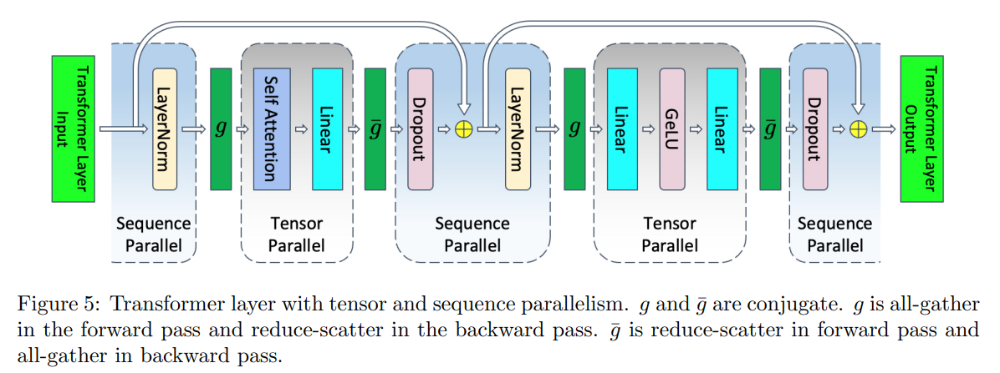
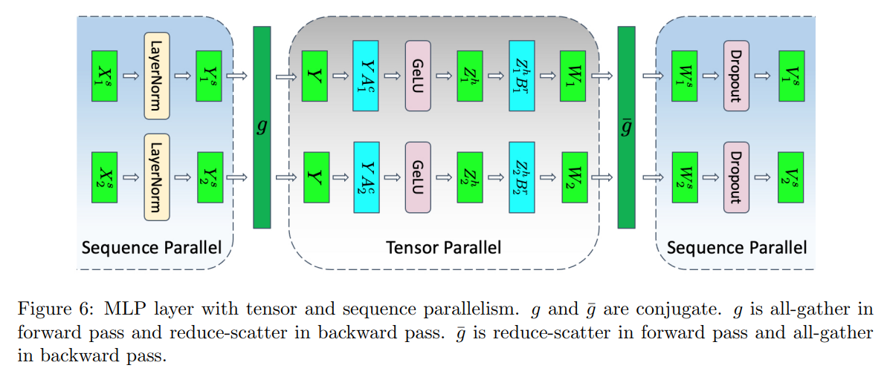

# 1. Tensor parallel

如下图所示，张量并行化了 Transformer 层中在训练期间占用大部分时间的部件，因此它在计算上是高效的。 但是，它保留了注意力和 MLP 模块之后的**layernorm以及dropout**，因此它们在张量并行组中被复制。 这些元素不需要大量的计算，但`需要大量的激活内存`**（缺点：Activition很大的话，在layernorm和dropout算子中会保留下来的，TP是解决不了的）**, 因为张量并行对他们无效。 

# 2. Sequece parallel

我们注意到在 Transformer 层的非张量并行区域中，操作**在序列维度上是独立的**。 这种特性允许我们在序列维度上对这些区域进行划分。 沿着序列维度进行划分减少了激活所需的内存。 这种额外的并行级别在TP前后通讯外引入了新的通信集合，它们将充当`序列和张量并行区域之间的转换器`。 这些额外的通信引入了开销，并会减慢训练速度。 

`[B, Seq, Emb]`

# 3. mlp TP and SP special

# 4 通讯开销

&nbsp;&nbsp;&nbsp;&nbsp;&nbsp;&nbsp;&nbsp;&nbsp;张量并行在单个正向和反向传播中需要四个全归约，而张量与序列并行在单个正向和反向传播中需要四个全聚合和四个归约散射。 乍一看，似乎张量与序列并行相比张量并行需要更多的通信。 然而，我们注意到环形全归约包含两个步骤：归约散射后跟全聚合。 因此，张量并行和张量与序列并行使用的通信带宽相同。 因此，序列并行不会引入任何通信开销。 

# 5 参考连接
- [论文连接-EN](https://arxiv.org/pdf/2205.05198)
- [论文连接-EN](https://yiyibooks.cn/arxiv/2205.05198v1/index.html)
