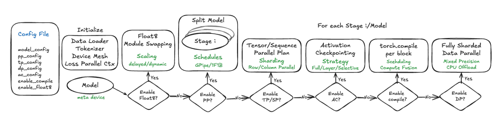
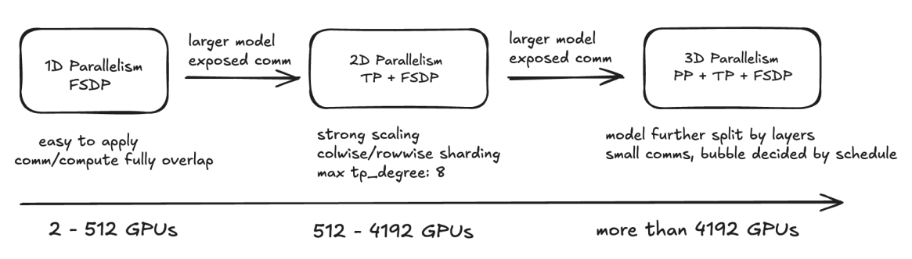

# 0 pytorch 3D parallel

- [参考论文](https://arxiv.org/abs/2401.10241)

| 名称                              | 描述                                                                                                                                                                                                 |
|-----------------------------------|-----------------------------------------------------------------------------------------------------------------------------------------------------------------------------------------------------|
| DTensor                           | Expressive tensor abstraction to replace flat parameter to manage parameter shard.                                                                                                                  |
| DeviceMesh                        | Device abstraction: represents the distributed system as a multi-dimensional array.                                                                                                                 |
| FSDP2 + TP Composability          | Incorporates user-selectable combinations of N-D parallelism training.                                                                                                                              |
| FSDP2 + TP + PP Composability     | Incorporates user-selectable combinations of N-D parallelism training.                                                                                                                              |
| Meta Device Initialization        | Init meta device on each device first and initialize the parameters according to sharding layouts and RNG (Random Number Generator).                                                                |
| Selective Activation Checkpoint   | Flexible AC (activation checkpoint) and SAC (selective activation checkpoint) options utilizing `torch.utils.checkpoint`.                                                                           |
| Region Compilation                | 通过区域编译，识别相同结构，缩短编译时间，同时和FSDP、TP相兼容，通过计算-通信重排提升吞吐和内存方面效率。                                                                                           |
| Asyn TP                           | 微流水线实现TP中计算和通信的重叠，同时利用SymmetricMemory抽象，通过在每个GPU上分配共享缓冲区实现更快通信。                                                                                          |
| Mixed Precision Training with Float8 | 支持了使用Float8进行更高级的混合精度训练（逐张量缩放策略、与autograd、torch.compile、fsdp2、TP组合）。                                                                                             |
| Distributed Checkpointing         | 通过DTensor封装全局和局部张量信息实现DCP，并与异步检查点技术相结合进一步提升效率。                                                                                                                 |
| HSDP (Hybrid Sharded Data Parallel) | HSDP相对于FSDP的通信饱和点可以将总world size扩展3-6倍。                                                                                                                                           |

# 1 torchtitan 未来发展
| 名称                              | 描述                                                                 |
|-----------------------------------|---------------------------------------------------------------------|
| 4D Parallel                       | 整合Context parallel，实现4D-Parallel。                             |
| Zero-Bubble Pipeline Schedules    | 参考论文：[arXiv:2401.10241](https://arxiv.org/abs/2401.10241)。    |
| External Contributions            | 构建和评估自定义创新。                                               |

# 2 torchtitan 使用及配置流程



## step 1 初始化模型并配置PP

```python
# meta init
with torch.device("meta"):
    model = model_cls.from_model_args(model_config)

# apply PP
pp_schedule, model_parts = models_pipelining_fns[model_name](
    model, pp_mesh, parallel_dims, job_config, device, model_config, loss_fn
)

# For PP with looped schedules, each item in model_parts is one stage-model-chunk.
# We need to iterate through model_parts to apply SPMD parallelisms, compilation,
# optimizer, and checkpointing
for m in model_parts:
    # apply SPMD-style distributed training techniques
    models_parallelize_fns[model_name](m, world_mesh, parallel_dims, job_config)
    # move sharded model to GPU and initialize weights via DTensor
    m.to_empty(device=init_device)
    m.init_weights(buffer_device=buffer_device)
    m.train()
```

**pp的具体配置流程** <br>

```python
def pipeline_llama(
    model: nn.Module,
    pp_mesh: DeviceMesh,
    parallel_dims: ParallelDims,
    job_config: JobConfig,
    device: DeviceType,
    model_config: ModelArgs,
    loss_fn: Callable[..., torch.Tensor],
):
    stages, models = pipeline_llama_manual_split(
        model, pp_mesh, parallel_dims, job_config, device, model_config
    )

    pp_schedule = build_pipeline_schedule(job_config, stages, loss_fn)

    return pp_schedule, models
```

## step2 TP、SP 配置
```python
    # Apply tensor + sequence parallelism to every transformer block
    # NOTE: At the cost of model code change, we can accelerate Sequence Parallel
    #       by folding (and unfolding) the batch dimension and the sequence dimension.
    #       Examples can be found at https://github.com/pytorch/torchtitan/pull/437
    for layer_id, transformer_block in model.layers.items():
        layer_plan = {
            "attention_norm": SequenceParallel(),
            "attention": prepare_module_input(
                input_layouts=(Shard(1), None),
                desired_input_layouts=(Replicate(), None),
            ),
            "attention.wq": colwise_parallel(),
            "attention.wk": colwise_parallel(),
            "attention.wv": colwise_parallel(),
            "attention.wo": rowwise_parallel(output_layouts=Shard(1)),
            "ffn_norm": SequenceParallel(),
            "feed_forward": prepare_module_input(
                input_layouts=(Shard(1),),
                desired_input_layouts=(Replicate(),),
            ),
            "feed_forward.w1": colwise_parallel(),
            "feed_forward.w2": rowwise_parallel(output_layouts=Shard(1)),
            "feed_forward.w3": colwise_parallel(),
        }

        parallelize_module(
            module=transformer_block,
            device_mesh=tp_mesh,
            parallelize_plan=layer_plan,
        )
```

## step3 配置FSDP

```python
def apply_fsdp(
    model: nn.Module,
    dp_mesh: DeviceMesh,
    param_dtype: torch.dtype,
    reduce_dtype: torch.dtype,
    tp_enabled: bool,
    pp_enabled: bool,
    cpu_offload: bool = False,
):
    """
    Apply data parallelism to the model. FSDP2 is used here.
    """
    mp_policy = MixedPrecisionPolicy(param_dtype=param_dtype, reduce_dtype=reduce_dtype)
    fsdp_config = {"mesh": dp_mesh, "mp_policy": mp_policy}
    if cpu_offload:
        fsdp_config["offload_policy"] = CPUOffloadPolicy()

    for layer_id, transformer_block in model.layers.items():
        if pp_enabled:
            # For PP, do not reshard after forward to avoid per-microbatch
            # all-gathers, which can be expensive and non-overlapped
            reshard_after_forward = False
        else:
            # As an optimization, do not reshard after forward for the last
            # transformer block since FSDP would prefetch it immediately
            reshard_after_forward = int(layer_id) < len(model.layers) - 1
        fully_shard(
            transformer_block,
            **fsdp_config,
            reshard_after_forward=reshard_after_forward,
        )
    fully_shard(model, **fsdp_config, reshard_after_forward=not pp_enabled)
```

# 3 模型配置



