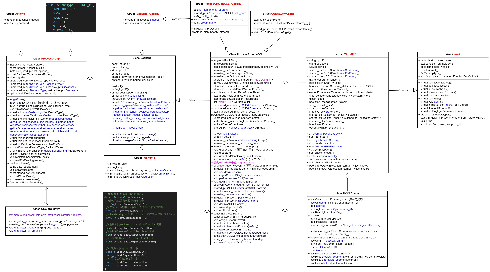

# 1 多进程启动及进程间通讯

- [distributed_c10d.py](https://github1s.com/pytorch/pytorch/blob/main/torch/distributed/distributed_c10d)

- [torchrun](https://pytorch.org/docs/stable/elastic/run.html)

```python
import os
import torch
import torch.distributed as dist
import torch.multiprocessing as mp
import datetime
from datetime import timedelta
import logging

logging.basicConfig(level=logging.DEBUG, format='%(asctime)s - %(levelname)s - %(message)s')

STORE_HOST = "127.0.0.1"
STORE_PORT = 45679

def run_main_store():
    return dist.TCPStore(
    STORE_HOST,
    STORE_PORT,
    is_master=True,
    wait_for_workers=False,
    timeout=datetime.timedelta(seconds=36000000))


def all_reduce(prefix, data, rank, world_size):
    timeout = datetime.timedelta(seconds=10)

    is_master = True if rank == 0 else False

    devices = torch.cuda.device_count()
    for i in range(devices):
        name = torch.cuda.get_device_name(i)
        logging.info(f"==========group: 2, device id: {i}, device name: {name}============")

    store = dist.TCPStore(
            STORE_HOST,
            STORE_PORT,
            is_master=False,
            wait_for_workers=False,
            timeout=timeout,
        )

    store = dist.PrefixStore(prefix, store)

    pg = dist.ProcessGroupNCCL(store, rank, world_size, timedelta(seconds=1000))
    work = pg.allreduce(data)
    work.wait()

    logging.info("all_reduce done")

if __name__ == "__main__":
    rank = int(os.getenv("RANK"))
    world_size = int(os.getenv("WORLD_SIZE"))
    replica_id = int(os.getenv("REPLICA_ID", 0))
    replica_num = int(os.getenv("REPLICA_NUM", 1))
    device_offset = int(os.getenv("DEVICE_OFFSET", 0))

    if rank == 1 and replica_id == 1:
        main_store = run_main_store()

    prefix = os.getenv("STORE_PREFIX", "abcdefg")
    prefix = prefix + "_" + str(rank)

    torch.cuda.set_device(rank + device_offset)
    dist.init_process_group("nccl", rank=rank, world_size=world_size)

    data = torch.randn(4,4).cuda()
    # dist.all_reduce(data, group=None)

    logging.info(f"rank: {rank}, replica_id: {replica_id}, data: {data}")

    logging.info(f"prefix: {prefix}, replica_id: {replica_id}, replica_num: {replica_num}, rank: {rank}, world_size: {world_size}")

    if rank == 1:
        ctx = mp.get_context("spawn")
        worker = ctx.Process(target = all_reduce, args=(prefix, data, replica_id, replica_num), daemon=True)
        worker.start()
        worker.join()

        logging.info(f"allreduce finished and output data: {data}")
        logging.info(f"run test_process_group.py successfully !!!")

    if rank == 0 and replica_id == 0:
        import time
        time.sleep(3)
```

# 2 运行脚本

```bash
#!/usr/bin/env bash

CUDA_VISIBLE_DEVICES=0,1,2,3 REPLICA_ID=0 REPLICA_NUM=2 torchrun --standalone --nnodes=1 --nproc-per-node=2 test_process_group.py &

CUDA_VISIBLE_DEVICES=0,1,2,3 DEVICE_OFFSET=2 REPLICA_ID=1 REPLICA_NUM=2 torchrun --nnodes=1 --nproc-per-node=2 --rdzv-endpoint=localhost:29400 test_process_group.py &
```

# 3 torchrun 启动流程


# 4 init_process_group 流程


# 5 process group




# 6 进程组的初始化方法

| 对比维度               | env://                                      | tcp://IP:PORT                                | file:///path/to/file                           |
|------------------------|---------------------------------------------|----------------------------------------------|------------------------------------------------|
| 核心机制               | 通过环境变量（MASTER_ADDR、MASTER_PORT 等）自动配置通信参数 | 显式指定主节点的 IP 和端口，通过 TCP 协议建立连接 | 利用共享文件系统同步进程信息，所有进程读写同一文件完成初始化 |
| 配置复杂度             | 低（需预先设置环境变量）                    | 中（需手动指定 IP 和端口）                   | 中（需确保共享文件路径可访问）                |
| 适用场景               | 动态集群（如 Kubernetes）、单机多卡训练     | 固定 IP 的局域网环境                         | 共享存储环境（如 NFS）                        |
| 优点                   | 1. 兼容性强 2. 适合自动化部署               | 1. 显式控制通信地址 2. 适合固定网络环境      | 1. 无需网络配置 2. 适合无网络依赖的共享存储场景 |
| 缺点                   | 1. 依赖环境变量注入 2. 环境变量未配置时报错 | 1. 需手动管理端口冲突 2. 灵活性较差          | 1. 文件系统可能成为性能瓶颈 2. 需处理文件读写权限 |
| 典型后端支持           | nccl（GPU）、gloo（CPU）                    | nccl（GPU）、gloo（CPU）                     | gloo（CPU）                                    |
| 示例代码               | python<br>```dist.init_process_group(backend='nccl', init_method='env://')``` | python<br>```dist.init_process_group(backend='nccl', init_method='tcp://10.0.0.1:23456')``` | python<br>```dist.init_process_group(backend='gloo', init_method='file:///mnt/nfs/shared_file')``` |

# 7 通过Store来交换信息

## 7.1 最终初始化处
- rank=0 的store 为 server 端，其他 rank 的store 为 client 端
- 当用agent store 时，在agent 处会单独创建一个server 的 Store；
- 各sub_group 通过prefixStore 来交换信息.

```python
    if not 0 <= port < 2**16:
        raise ValueError(f"port must have value from 0 to 65535 but was {port}.")

    if _torchelastic_use_agent_store():
        attempt = os.environ["TORCHELASTIC_RESTART_COUNT"]
        tcp_store = TCPStore(hostname, port, world_size, False, timeout)
        return PrefixStore(f"/worker/attempt_{attempt}", tcp_store)
    else:
        start_daemon = rank == 0
        return TCPStore(
            hostname,
            port,
            world_size,
            start_daemon,
            timeout,
            multi_tenant=True,
            use_libuv=use_libuv,
        )
```

## 7.2 函数调用栈


## 7.3 MasterStore 在elastic 模式下在多进程创建前就启动
```python
[R0] ipdb>   /opt/conda/envs/py310/bin/torchrun(33)<module>()
[R0]      31 if __name__ == '__main__':
[R0]      32     sys.argv[0] = re.sub(r'(-script\.pyw?|\.exe)?$', '', sys.argv[0])
[R0] ---> 33     sys.exit(load_entry_point('torch==2.5.0', 'console_scripts', 'torchrun')())
[R0]
[R0]   /opt/conda/envs/py310/lib/python3.10/site-packages/torch/distributed/elastic/multiprocessing/errors/__init__.py(355)wrapper()
[R0]     354             try:
[R0] --> 355                 return f(*args, **kwargs)
[R0]     356             except SystemExit as se:
[R0]
[R0]   /opt/conda/envs/py310/lib/python3.10/site-packages/torch/distributed/run.py(919)main()
[R0]     918     args = parse_args(args)
[R0] --> 919     run(args)
[R0]     920
[R0]
[R0]   /opt/conda/envs/py310/lib/python3.10/site-packages/torch/distributed/run.py(910)run()
[R0]     909     config, cmd, cmd_args = config_from_args(args)
[R0] --> 910     elastic_launch(
[R0]     911         config=config,
[R0]
[R0]   /opt/conda/envs/py310/lib/python3.10/site-packages/torch/distributed/launcher/api.py(138)__call__()
[R0]     137     def __call__(self, *args):
[R0] --> 138         return launch_agent(self._config, self._entrypoint, list(args))
[R0]     139
[R0]
[R0]   /opt/conda/envs/py310/lib/python3.10/site-packages/torch/distributed/launcher/api.py(241)launch_agent()
[R0]     240         args=tuple(args),
[R0] --> 241         rdzv_handler=rdzv_registry.get_rendezvous_handler(rdzv_parameters),
[R0]     242         max_restarts=config.max_restarts,
[R0]
[R0]   /opt/conda/envs/py310/lib/python3.10/site-packages/torch/distributed/elastic/rendezvous/registry.py(80)get_rendezvous_handler()
[R0]      78       my_rdzv_handler = get_rendezvous_handler("my_rdzv_backend_name", RendezvousParameters)
[R0]      79     """
[R0] ---> 80     return handler_registry.create_handler(params)
[R0]
[R0]   /opt/conda/envs/py310/lib/python3.10/site-packages/torch/distributed/elastic/rendezvous/api.py(367)create_handler()
[R0]     366
[R0] --> 367         handler = creator(params)
[R0]     368
[R0]
[R0]   /opt/conda/envs/py310/lib/python3.10/site-packages/torch/distributed/elastic/rendezvous/registry.py(41)_create_c10d_handler()
[R0]      40
[R0] ---> 41     backend, store = create_backend(params)
[R0]      42
[R0]
[R0]   /opt/conda/envs/py310/lib/python3.10/site-packages/torch/distributed/elastic/rendezvous/c10d_rendezvous_backend.py(260)create_backend()
[R0]     259         elif store_type == "tcp":
[R0] --> 260             store = _create_tcp_store(params)
[R0]     261         else:
```


## 7.4 几个TCPStore的初始化方式
```python
register_rendezvous_handler("tcp", _tcp_rendezvous_handler)
register_rendezvous_handler("env", _env_rendezvous_handler)
register_rendezvous_handler("file", _file_rendezvous_handler)
```
