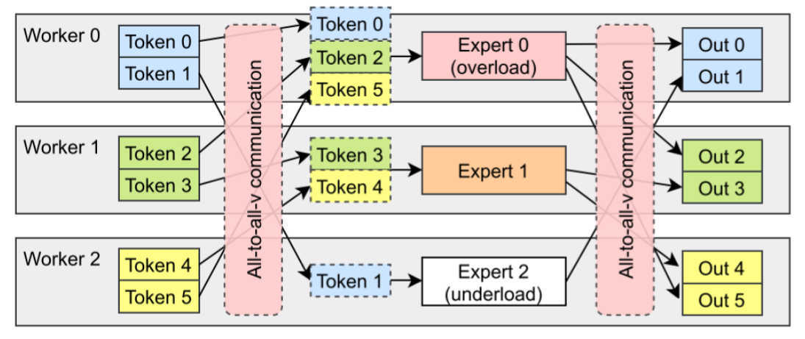
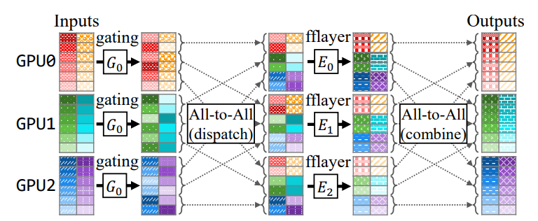
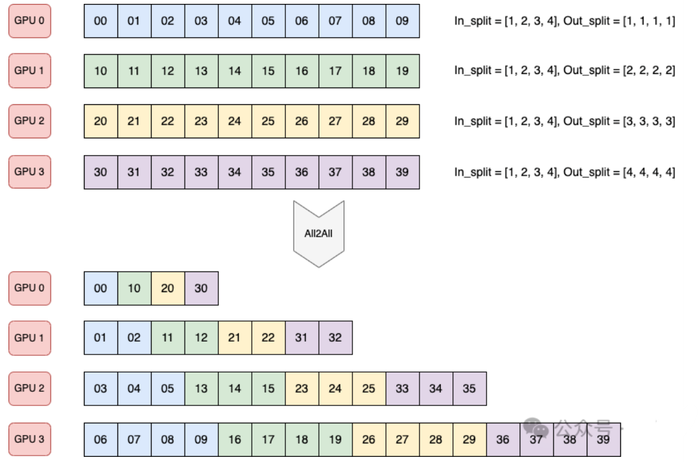

# 1 NCCL doc
- [Nccl doc](https://docs.nvidia.com/deeplearning/nccl/user-guide/docs/index.html)

# 2. NCCL collective ops
- [collective ops](https://docs.nvidia.com/deeplearning/nccl/user-guide/docs/usage/collectives.html)

# 3. AllTOAll

在 All-to-All（**Dispatch**）操作之前需要准备好 All-to-All 的输入；在 All-to-All（**Combine**）操作之后需要解包 All-to-All 的输出，组织为原始的顺序.

